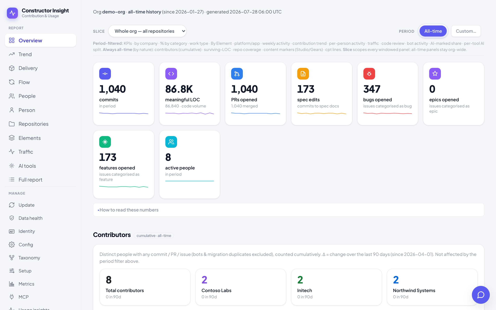
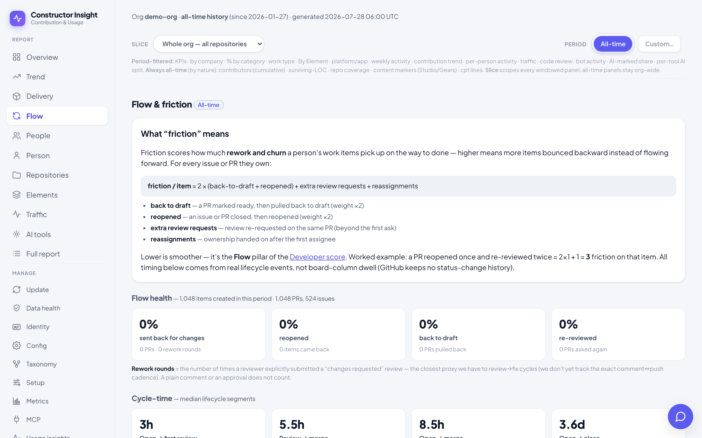
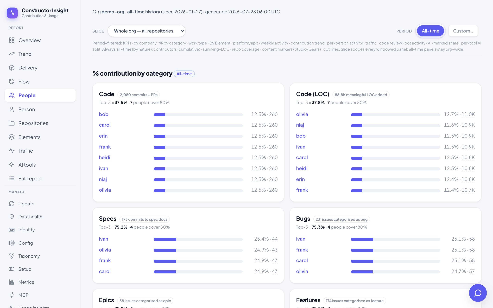

# Insight Lite — Contribution & Usage Report

**How is development actually going?** GitHub holds the evidence — every commit, review,
pull request and issue — but answers none of it. So the question gets answered by
anecdote, by whoever spoke last in the retro, or by a number someone computed once and
nobody trusts.

This is a self-hosted tool that answers it from your own GitHub organisation. Point it at
any org you can read and it turns the raw events into engineering-productivity and
delivery analytics: throughput and cycle time, where work stalls, who carries the review
load, which products absorb the effort, how much of the code is AI-generated, and whether
any of it is moving in the right direction over time.

Any GitHub user can install it and aim it at their own org — nothing here is specific to
the organisation it was built for.

### Why another one

- **Your data stays yours.** It runs on your machine, stores everything in a local SQLite
  database, and talks to nothing but the GitHub API. No account, no vendor.
- **Every number says how much to trust it.** Signals are badged *exact* or *heuristic*
  wherever they appear, because an authenticated bot trailer and a word in a commit
  message are not the same evidence and a dashboard that blurs them is worse than no
  dashboard.
- **Attribution is explicit and reviewable.** Deciding which commits belong to which
  human is the step that quietly invalidates everything downstream, so identity
  resolution has confidence levels, evidence, and a review workflow instead of a guess.
- **It is loud when it breaks.** A panel that cannot be built says why; `/health/data`
  answers 503 when collection has stopped. Stale numbers that look fine are the failure
  mode this kind of tool has by default.
- **It takes measuring people seriously.** See the note below — that is a deliberate part
  of the design, not a disclaimer.

Every org, repository, company and person appearing in this repository is invented,
including in the examples below.

> **A note on measuring people.** This tool aggregates identifiable per-person
> activity, which is personal data in most jurisdictions and a management artefact
> everywhere. The per-person Developer score in particular is explicitly
> experimental and is not a performance rating. Decide who may see it before you
> deploy it — the portal supports OAuth so that decision is enforceable.




<table>
<tr>
<td width="50%"><a href="docs/screenshots/flow.png"></a><br><sub><b>Flow</b> — where work stalls: rework, cycle-time segments, work in flight</sub></td>
<td width="50%"><a href="docs/screenshots/people.png"></a><br><sub><b>People</b> — activity, review load and work categories per person</sub></td>
</tr>
</table>

<sub>Screenshots are generated from `reportctl.py demo-seed` — every person, company and
repository in them is invented.</sub>

## What you can ask it

Concrete questions the report answers out of the box, each on its own panel and each
re-sliceable by period and by scope:

**Is delivery getting better or worse?**
- What is our median time from opening a pull request to merging it, and how has it moved
  over the last quarter?
- How much of the cycle is waiting for a first review, and how much is after approval?
- What share of pull requests get reviewed at all?

**Where does work actually get stuck?**
- Which pull requests have been open longest, and which have had no review after a week?
- How much work is in flight right now — and who is carrying it?
- How often does work bounce: reopened issues, pull requests pushed back to draft,
  review re-requests?
- Which pull requests were closed without merging, and why — withdrawn after feedback, or
  never looked at?

**Who is doing what?**
- Who carries the review load, as opposed to who opens the most pull requests?
- How is effort split across products, repositories and companies?
- Which code from a year ago is still alive in the tree today, and who wrote it?

**How much of this is AI now?**
- What share of commits carry an AI-tool marker, per tool, and how is that trending?
- How much of the current tree can be traced to generated or assistant-marked code?

**Is anyone using our work without contributing back?**
- Which accounts forked a repository but never contributed to any of them?

If a question is not on that list, the data is in a local SQLite database with a
documented schema, a **custom-dashboard builder** for assembling new panels without code,
and an **MCP server** so an LLM client can query it directly.

## What you get

Ten report views — each re-sliceable by period (7d / 30d / 90d / 1 year /
all-time / custom range) and by scope (whole org, product area, single repository):

| | |
|---|---|
| **Overview** | headline KPIs, commit mix, work type, contribution by company |
| **Trend** | the same numbers over time, from accumulated daily snapshots |
| **Delivery** | throughput and cycle time |
| **Flow** | where work gets stuck: review latency, reopens, work in flight, PRs closed without merging |
| **People** | the per-person table — activity, review load, categories |
| **Person** | one person's dashboard, including the experimental Developer score |
| **Repositories** / **Elements** | coverage and effort by repository and by product area |
| **Traffic** | clones and page views, accumulated daily (GitHub keeps only 14 days) |
| **AI tools** | which commits carry an AI-tool marker, and how much of the tree came from where |

**And the parts that make it usable rather than a one-off script:**

- **Custom dashboards** — build your own panels from the same measures, no code.
- **Identity resolution** with confidence levels and a review workflow, because guessing
  which commits belong to which human is what quietly invalidates everything downstream.
- **A semantic taxonomy** mapping your labels to work types, resolved per repository,
  element or org — so one label can mean different things in different places.
- **An MCP server** exposing the data read-only, so an LLM client can query it directly.
- **A metrics assistant** that answers questions about the report by calling those tools.
- **A data-health page** that names the gaps in the collected data instead of hiding them.
- **`/health/data`**, which answers 503 when the data has stopped being refreshed — so a
  dead collector is something you get paged about rather than something you notice a week
  later.

## One lens worth explaining: contributing vs using

Most of the report is the usual thing — activity, delivery, flow, per-repository and
per-person breakdowns — and needs no explanation. One axis does, because it is unusual
and it is configurable, so it is worth knowing whether it applies to you.

If some of your repositories are a shared platform and others are products built on top
of it, the interesting split stops being "who commits the most" and becomes:

1. **Contributing to the platform** — anyone with **any** contribution (commit, PR,
   spec edit, bug, or feature) to **any** repo in the org, split into org members
   vs external.
2. **Using the platform without contributing back** — accounts that **forked** an
   org repo (= using it) but made **zero** contribution to any org repo in the
   window.

The repository types that axis compares are yours to define — "platform" and "app" are
just the shipped example, and you can rename them, add more, or ignore the whole idea and
use the report for plain activity and delivery numbers. They are set per repository on
**Manage → Config**, or in `config.yaml` → `repo_types` and `repos`.

> GitHub-only data: passive consumption beyond forks/stars, and anonymous clone
> traffic, are not observable — the numbers here are a floor, not a census.
> Repo classification lives in [`config.yaml`](config.yaml); label→category mapping
> lives in the database-backed semantic taxonomy (see [`docs/semantic-config.md`](docs/semantic-config.md)).


## Before you start

- **A GitHub token** with `read:org` + `repo`. The setup wizard takes it in the browser
  and stores it in the database; `GH_TOKEN` / `GITHUB_TOKEN` also work. Everything else
  that can be configured by environment is documented in [`.env.example`](.env.example)
  — copy it to `.env` when you need one, it is optional.
- **`git`** on PATH. Commits, surviving-LOC and content markers come from real clones,
  not the API, so the collector shells out to `git`.
- **Docker** for the compose path — this is the recommended one, and it builds the
  React bundle for you.
- To run it **from source** instead: **Python 3.9+** (CI and the image use 3.12) *and*
  **Node 20+**. The UI is a React app whose bundle is not committed, so it has to be
  built once with `cd frontend && npm install && npm run build`; the pages say so if you
  skip it. The collector, the API and the MCP server are pure Python — only the rendered
  pages need the bundle.
- Disk for the clones: the collector keeps full clones under `.repos/`.
- Nothing else. No database to provision — SQLite is created on first use, and so is
  every directory under `DATA_DIR`.

## Run it

Three ways in, and they are not alternatives to choose between blindly — they answer
different questions.

### The portal, with Docker — start here

From the published image, no checkout needed beyond a compose file:

```bash
docker compose up -d
```

Or build it yourself from a clone — the local override does that automatically:

```bash
docker compose up --build
```

The image is `ghcr.io/constructorfabric/insight-lite:latest`, built for amd64 and arm64,
published only from commits whose test suite passed. Every build is also tagged with its
commit SHA if you would rather pin one.

Open <http://localhost:8080>. The setup wizard asks for a GitHub token and your org,
stores both in the database, and offers to run the first collection. Nothing to prepare
and nothing to edit.

This is the recommended path because Docker builds the React bundle for you, and because
the portal is what makes the tool usable: it refreshes the data, serves the report, edits
identity and configuration, and exports snapshots.

### The portal, from source — if you would rather not use Docker

```bash
python3 -m venv .venv && . .venv/bin/activate
pip install -r requirements.txt
cd frontend && npm install && npm run build && cd ..   # the UI is React; the bundle is not committed
python backend/reportctl.py serve --port 8080
```

Same portal, same wizard. The `npm` step is the only reason this path needs Node — skip
it and every page will tell you so instead of rendering.

### Just looking? Seed it with invented data

No token, no org, no waiting for a collection:

```bash
python backend/reportctl.py demo-seed        # ~0.1s, everything in it is fictional
python backend/reportctl.py serve --port 8080
```

That is what the screenshots above are. It is also the fixture the test suite renders the
full report from, so it stays a working stand-in rather than rotting quietly.

### One shot, no portal — for a cron job or a look around

```bash
./scripts/run.sh                 # collect, render, open report.html
./scripts/run.sh --no-open       # same without opening a browser
```

Creates the venv, installs dependencies, collects and renders. Uses `$GH_TOKEN` /
`$GITHUB_TOKEN`, falling back to `gh auth token`.

### Configuring it

Everything the wizard asks for lives in the **database**, not in a file — so a
deployment keeps its configuration when the code is updated. The rest of the settings
(repository classification, product elements, company domains, detection rules) are on
**Manage → Config** in the portal.

[`config.yaml`](config.yaml) is the bootstrap default underneath that, and every value in
it is invented. If you already run this and want the file to stop mattering — because it
now arrives from git, or from inside an image — capture it once:

```bash
python backend/reportctl.py config-capture   # file -> database
python backend/reportctl.py config-verify    # proves the database is now sufficient; exits 1 if not
```

For secrets and anything the wizard does not cover — `PORTAL_PASSWORD`, `MCP_TOKEN`,
`ALERT_WEBHOOK_URL`, the OAuth settings, the metrics-assistant keys — copy the template:

```bash
cp .env.example .env
```

`.env` is git-ignored and entirely optional; a fresh clone starts without one.

> Compose reads `.env` when it **creates** a container, so after editing it run
> `docker compose up -d report`. A plain `restart` will not pick the change up.

### Before you expose it

The portal binds loopback and runs without authentication by default. Set
`PORTAL_PASSWORD` (and optionally `PORTAL_USER`) to require HTTP Basic auth on *every*
request, or put it behind an authenticating proxy — [`deploy/oauth/`](deploy/oauth/) has
a GitHub-OAuth gate that admits your org's members. With no password and a non-loopback
bind, the server prints a loud warning at startup.

This matters more than it would for most tools: the report names individuals.

## Test locally

```bash
python3 -m venv .venv && . .venv/bin/activate
pip install -r requirements.txt
python -m unittest discover -s tests -v
python -m py_compile collect.py render.py ghclient.py identity.py directory.py reportctl.py server.py tests/test_rules.py
```

## Scheduling the refresh

There is deliberately **no scheduled GitHub Actions workflow** in this repository. One
used to live here, and it is the wrong shape for a tool that publishes per-person
statistics: a workflow on a `schedule:` runs in every fork that has secrets, its email
step fires unconditionally, and its Pages step would put names, companies and per-person
figures on a **public** URL. That is a lot of blast radius for a convenience.

Run the refresh where you can see it instead:

```bash
docker compose exec report python backend/reportctl.py all     # collect + rebuild
```

For a nightly refresh, use cron on the host — the portal is long-running anyway:

```cron
30 3 * * *  cd /path/to/insight && docker compose exec -T report python backend/reportctl.py all \
              >> /var/log/insight-report.log 2>&1 || docker compose exec -T report python backend/alert.py notify "refresh failed"
```

Point a monitor at `/health/data`, which answers **503** once the newest run is older
than `HEALTH_MAX_AGE_HOURS`, and set `ALERT_WEBHOOK_URL` so a failed run reaches a
channel rather than only a log file. A refresh that dies silently is the failure mode
this project has already had once.

If you do want it in Actions, write the workflow yourself so the decisions are yours:
give it an org-scoped PAT, and think hard before adding any step that publishes the
rendered report somewhere public.


## MCP server (read-only data access)

`mcp_server.py` exposes the report's data to MCP clients (e.g. Claude) over
streamable HTTP — every tool is **read-only**. Docker Compose runs it as the `mcp`
service on `127.0.0.1:8082` (front it with the same reverse proxy as the portal).

Set `MCP_TOKEN` in `.env`; clients must then send `Authorization: Bearer <token>`.
Unset = unauthenticated (only safe on localhost / behind an authenticating proxy) —
the server warns loudly at startup. Connect a client to `https://<host>/mcp`.

Tools: `describe_schema`, `sql_query` (single SELECT/WITH, `PRAGMA query_only`),
`contribution(since, until, scope, member_only)`, `delivery(since, until, scope)`,
`person(login)`, `list_dimension(kind)`, `taxonomy(level, target)`. `scope` slices to
a repo subset, e.g. `element:Insight`, `org:your-old-org`, `repo:org/name`.

```bash
MCP_TOKEN=… python backend/mcp_server.py         # local, serves /mcp on :8082
```

## Documentation

- [Metrics & panels](docs/metrics.md) — what every number means, and how much to trust it
- [Identity resolution](docs/identity.md) — how activity is attributed to people
- [Data & storage](docs/data.md) — sources, the SQLite store, and what cannot be recovered
- [Operating it](docs/operating.md) — Docker, deployment, tuning, pre-share checks
- [Semantic taxonomy](docs/semantic-config.md) — mapping labels to work types
- [Contributing](CONTRIBUTING.md) — dev loop, test runners, review expectations

## Licence

Apache License 2.0 — see [`LICENSE`](LICENSE) and [`NOTICE`](NOTICE).
